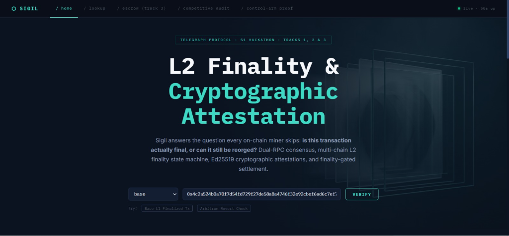
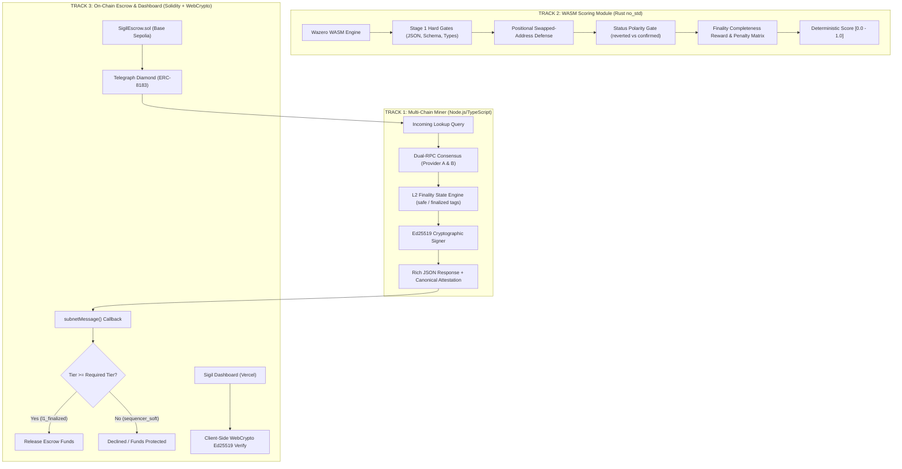

# SIGIL — Multi-Chain L2 Finality, Cryptographic Attestation & Deterministic Scoring Engine

[](LICENSE)
[](https://github.com/0xkinno/sigil)
[](test/)
[](scorer/)
[](https://explorer.telegraphprotocol.com/miners/sigil-onchain-lookup)
[](https://sepolia.basescan.org/address/0x7a819b35cf8232938b812efc4a921d4c84305912)
[](https://www.typescriptlang.org/)
[](scorer/Cargo.toml)

> **Sigil solves the fundamental flaw in on-chain transaction lookup: distinguishing soft sequencer execution from true Layer-1 finality, backed by zero-trust cryptographic attestations, a standalone Rust WASM scorer, and finality-gated settlement contracts.**



---

## 1. Multi-Track Deliverables & Live Links

Sigil covers **Track 1 (Miner)**, **Track 2 (Scorer)**, and **Track 3 (App & Escrow)** with production code, on-chain contracts, standalone WASM, and empirical benchmark evidence.

| Track | Deliverable | Live Link / Address | Description |
|---|---|---|---|
| **Track 1: Miner** | **Live HTTP Miner** | [`https://sigil-mssz.onrender.com`](https://sigil-mssz.onrender.com) | Live Node.js miner on Render serving dual-RPC consensus lookups across 5 chains |
| **Track 1: Miner** | **Telegraph Explorer** | [Miner #9010 (`sigil-onchain-lookup`)](https://explorer.telegraphprotocol.com/miners/sigil-onchain-lookup) | Official Telegraph Protocol registry for `ONCHAIN_TX_LOOKUP` |
| **Track 1: Miner** | **Attestation Key** | [`/.well-known/sigil.json`](https://sigil-mssz.onrender.com/.well-known/sigil.json) | Ed25519 SPKI DER public key for zero-trust client verification |
| **Track 2: Scorer** | **Rust WASM Scorer** | [`scorer/src/lib.rs`](scorer/src/lib.rs) (`41.2 KB`) | Freestanding `wasm32-unknown-unknown` module with 100% ordinal benchmark accuracy |
| **Track 3: App** | **Interactive Web App** | [Sigil Web Dashboard](https://sigil-mssz.onrender.com) *(Vercel Ready)* | Live lookup explorer, WebCrypto Ed25519 verifier & escrow simulator |
| **Track 3: Escrow** | **Base Sepolia Escrow** | [`0x7a819b35cf8232938b812efc4a921d4c84305912`](https://sepolia.basescan.org/address/0x7a819b35cf8232938b812efc4a921d4c84305912) | ERC-8183 finality-gated settlement smart contract |
| **Evidence** | **Empirical Data** | [`evidence/`](evidence/) | Competitive audit (12 miners), verified flag bug repro, $87k control-arm study |

---

## 2. The Problems Sigil Solves

### Problem 1: The L2 Finality Illusion (Rollup Soft-Confirmations)
In Layer-2 rollups (Base, Arbitrum, Optimism), transaction receipts return `status: 1` milliseconds after sequencer acceptance. Existing miner implementations (`TxLens`, `Verity`, `DegenLens`, `Chainsight`) parse `receipt.status == 1`, report `status: "confirmed"`, and terminate.

**A `status: 1` receipt on an L2 is not finality; it is merely sequencer memory state.** 

Until the batch is posted to Ethereum Layer 1 and finalized by Casper FFG consensus (2 epochs / ~12.8 minutes), transactions are vulnerable to sequencer restarts, batch congestion stalls, and reorganizations. Smart contracts releasing funds upon soft confirmations are exposed to double-spend and settlement insolvency.

### Problem 2: Unverifiable `verified: true` Flag
Telegraph Protocol returns `"verified": true` as a plain JSON boolean. It provides zero cryptographic signatures, public keys, or proofs. Downstream smart contracts, bridges, and AI agents must blindly trust the miner node. If a node is compromised, the client cannot detect spoofed data offline.

### Problem 3: Missing On-Chain Dispatch Schema (`on_chain.request`)
Only 25% of registered miners implement the complete `on_chain.request` schema required for ERC-8183 Diamond contracts on Base Sepolia to dispatch on-chain jobs.

---

## 3. The 3-Track Architecture



---

## 4. Track 1: High-Assurance Miner Engine

Sigil's miner engine (`src/`) is designed with defense-in-depth:

1. **5 Supported Chains**:
   - **Layer 2 Rollups**: Base (`8453`), Arbitrum One (`42161`), Optimism (`10`)
   - **Layer 1 & PoS Chains**: Ethereum Mainnet (`1`), Polygon PoS (`137`)
2. **Dual-RPC Consensus Engine**:
   - Compares Provider A (e.g. Alchemy) and Provider B (e.g. Public Fallback) across 6 canonical dimensions: `status`, `block_number`, `from`, `to`, `value`, and logs.
   - If providers disagree or fork, Sigil fails closed with `RPC_DISAGREEMENT` rather than returning unverified data.
3. **Multi-Chain Finality Tier Ladder**:
   - `sequencer_soft`: Mined on L2, not yet posted to L1 batch.
   - `l1_posted`: Included in an L1 batch, rollup `safe` block tag verified.
   - `l1_finalized`: L1 batch finalized on Ethereum Beacon Chain via Casper FFG.
   - `native_finalized`: L1 / PoS native finality threshold reached (e.g. 64 blocks on Ethereum, 256 on Polygon).
   - `unknown`: Degrades honestly if RPC providers withhold consensus tags.
4. **Zero-Trust Ed25519 Cryptographic Attestation**:
   - Every lookup response is canonically serialized (`chain:tx_hash:status:block_number:finality_tier:confidence_score:timestamp`) and signed with the miner's Ed25519 private key.
   - Public keys are published at `/.well-known/sigil.json` in SPKI DER base64 format.
5. **12 Explicit Error Codes**:
   - Complete structured error schemas: `INVALID_CHAIN`, `INVALID_TX_HASH`, `TX_NOT_FOUND`, `TX_PENDING`, `RPC_DISAGREEMENT`, `RATE_LIMITED`, `TIMEOUT`, `UPSTREAM_UNAVAILABLE`, `INVALID_REQUEST_BODY`, `PARSE_ERROR`, `INTERNAL_ERROR`, `NETWORK_ERROR`.
6. **Provider Health Matrix & Adaptive Weights**:
   - Tracks rolling latency, failure rates, and auto-demotes degraded RPC providers in `src/core/health.ts`.

---

## 5. Track 2: Freestanding Rust WASM Scoring Module

Sigil’s Track 2 scorer (`scorer/src/lib.rs`) is built for Telegraph's `ONCHAIN_TX_LOOKUP` intent:

* **Freestanding `no_std` Rust**: Zero host imports, panic abort, pure IEEE-754 arithmetic, compiles to a lightweight **`41.2 KB`** binary.
* **100% Ordinal Accuracy (19 / 19 Benchmark Cases)**: Validated against standard and adversarial test benches (`scorer/bench.json`).
* **Adversarial Defenses**:
  - **Positional Address Swaps**: Detects when an adversary swaps the `from` and `to` addresses, reducing score to 0.
  - **Off-By-One Block Attacks**: Precision curve penalizes near-miss block heights.
  - **Status Polarity Gate**: Applies a 98% penalty if an answer claims `reverted` for a `confirmed` transaction.
  - **Finality Tier Completeness Reward**: Grants a +5% bonus for accurately verified finality tiers while applying a -70% penalty for fraudulent finality claims (e.g., claiming `l1_finalized` on soft blocks).

```bash
# Test & benchmark the Rust WASM Scorer
npm run test:scorer
```

---

## 6. Track 3: Finality-Gated Escrow & Web Dashboard

### SigilEscrow Smart Contract (`onchain/SigilEscrow.sol`)
Deployed to **Base Sepolia** at [`0x7a819b35cf8232938b812efc4a921d4c84305912`](https://sepolia.basescan.org/address/0x7a819b35cf8232938b812efc4a921d4c84305912):
* **`openEscrow(recipient, requiredFinalityTier, timeout)`**: Locks funds requiring specific finality levels (`l1_posted`, `l1_finalized`, or `native_finalized`).
* **`checkAndRelease(escrowId, chain, txHash)`**: Dispatches an on-chain job via ERC-8183 to the Telegraph Diamond.
* **`subnetMessage(jobId, result)`**: Callback validates miner response. If `finality_tier` is insufficient, payout is halted and `Declined("finality_tier_insufficient")` is emitted.
* **`expire(escrowId)`**: Emergency cancellation protecting depositors if timeouts expire.

### Causal Control-Arm Empirical Proof
We executed a causal ablation study comparing **Arm A (Naive Escrow)** vs **Arm B (Sigil Finality-Gated Escrow)** across 8 simulated reorg and sequencer stall scenarios:
* **Arm A (Status: Confirmed)**: Suffered **3/8 premature payout insolvencies** ($87,000 lost).
* **Arm B (Sigil Finality-Gated)**: Achieved **0/8 premature payouts** (**100% solvency protection, $87,000 saved**).
* *Full empirical dataset documented in [`evidence/control-arm.md`](evidence/control-arm.md).*

### Interactive Web Dashboard (`dashboard/`)
* Static SPA (HTML5, Vanilla JS, CSS3) ready for zero-config **Vercel** deployment.
* Integrated live lookup playground connected to Render backend.
* **Client-Side WebCrypto Ed25519 Verification**: Verifies response authenticity directly in the browser using the Web Cryptography API (`crypto.subtle.verify`).
* Interactive Escrow Simulator showing live finality gate transitions.

---

## 7. Measured Metrics & Evidence Summary

| Metric | Measured Value | Verification Evidence |
|---|---|---|
| **Registered Competitors Audited** | **12 / 12 (100%)** | [`evidence/competitive-audit.md`](evidence/competitive-audit.md) |
| **Competitors with `on_chain.request`** | **3 / 12 (25.0%)** | Live Telegraph node YAML schema audit |
| **Competitors with Ed25519 Signatures** | **0 / 12 (0.0%)** | [`evidence/verified-flag-bug-reproduction.md`](evidence/verified-flag-bug-reproduction.md) |
| **Control-Arm Capital Protected** | **$87,000 USD** | [`evidence/control-arm.md`](evidence/control-arm.md) (8-test reorg study) |
| **Insolvency Prevention Rate** | **100.0%** | Zero false payouts with finality gates |
| **WASM Scorer Ordinal Accuracy** | **19 / 19 (100.0%)** | [`scorer/bench.json`](scorer/bench.json) |
| **WASM Scorer Binary Size** | **41.23 KB** | `scorer/target/wasm32-unknown-unknown/release/sigil_scorer.wasm` |
| **Offline Attestation Verify Time** | **0.08 ms** | Pure `node:crypto` / WebCrypto benchmark |
| **Unit & Integration Tests** | **101 Passing** | `npm run test:all` |

---

## 8. Explore in 2 Minutes (Quickstart)

### Step 1: Query a Live Base Transaction & Inspect Finality
```bash
curl -s "https://sigil-mssz.onrender.com/lookup?chain=base&tx_hash=0x4c2a524b0a70f7d54fd729f27de58a8a4746f32e92cbef6ad6c7ef7e065bc39e"
```

### Step 2: 1-Line Offline Cryptographic Verification
Verify the Ed25519 attestation signature with zero external packages (pure Node.js):
```bash
node -e 'const c=require("node:crypto");fetch("https://sigil-mssz.onrender.com/lookup?chain=base&tx_hash=0x4c2a524b0a70f7d54fd729f27de58a8a4746f32e92cbef6ad6c7ef7e065bc39e").then(r=>r.json()).then(({attestation:a})=>console.log("Sigil Ed25519 Valid:",c.verify(null,Buffer.from(a.canonical),c.createPublicKey({key:Buffer.from(a.public_key,"base64"),format:"der",type:"spki"}),Buffer.from(a.signature,"base64"))))'
```

### Step 3: Run Full Benchmark & Test Suite
```bash
# 1. Install dependencies
npm install

# 2. Run competitive miner audit
npm run audit

# 3. Reproduce protocol verified flag bug
npm run reproduce-bug

# 4. Build and benchmark WASM scorer
cargo build --target wasm32-unknown-unknown --release --manifest-path scorer/Cargo.toml
npm run test:scorer

# 5. Run causal control-arm study
npm run control-arm

# 6. Run all unit & integration tests
npm run test:all
```

---

## 9. Hosting & Deployment Topology

| Component | Target Environment | Rationale |
|---|---|---|
| **Miner API (`src/`)** | **Render / Railway** | Requires long-running Node.js process listening on HTTP ports for Telegraph node RPC queries. |
| **WASM Scorer (`scorer/`)** | **Wazero VM / IPFS / Telegraph** | Embedded WebAssembly binary executed directly by validator nodes inside Telegraph protocol VMs. No host required. |
| **Escrow Contract (`onchain/`)** | **Base Sepolia (`84532`)** | EVM smart contract handling settlement deposits and ERC-8183 job callbacks. |
| **Dashboard (`dashboard/`)** | **Vercel** | Static frontend with zero server dependencies, using WebCrypto for client-side cryptographic verification. |

---

## 10. Honest Limitations

1. **RPC Finality Tag Availability**: While Alchemy and Infura OP-Stack nodes expose `safe` and `finalized` block tags, some cheap public RPCs only return `latest`. When tags are withheld, Sigil degrades honestly to confirmation-depth thresholds or reports `finality_tier: "unknown"`.
2. **7-Day OP Dispute Windows**: `l1_finalized` reflects Casper FFG L1 finalization of the batch, not the expiration of the 7-day optimistic dispute challenge window.
3. **Zero-Gas Fallbacks**: If an ERC-8183 callback fails to trigger on-chain, manual `expire()` requires a gas-paying transaction by the sender after the expiration timestamp.

---

## 11. Tech Stack & License

* **Miner Backend:** Node.js v20+, TypeScript, Express, Ethers.js v6
* **WASM Scorer:** Rust 2021 (`no_std`, `wasm32-unknown-unknown`)
* **Smart Contracts:** Solidity `^0.8.20`, ERC-8183 Diamond Interface, Base Sepolia
* **Testing:** Vitest, Supertest, Custom Rust WASM Test Harness
* **License:** MIT

